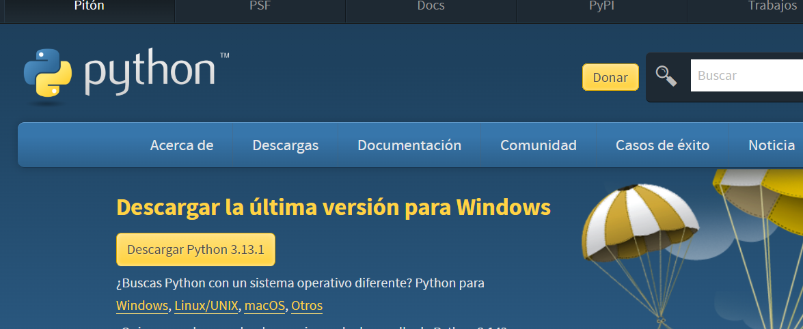
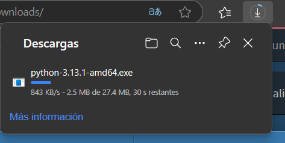
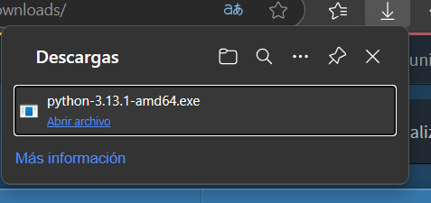
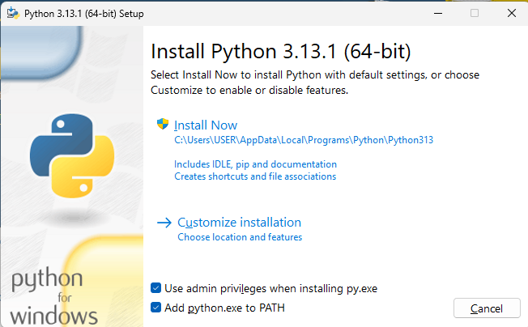
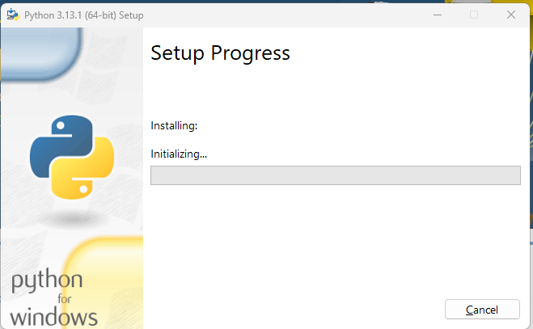
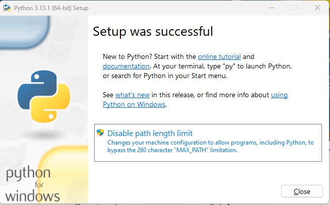
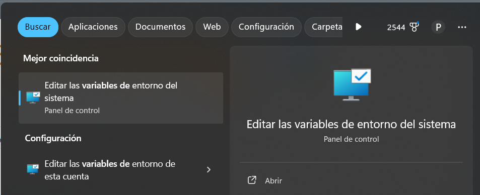
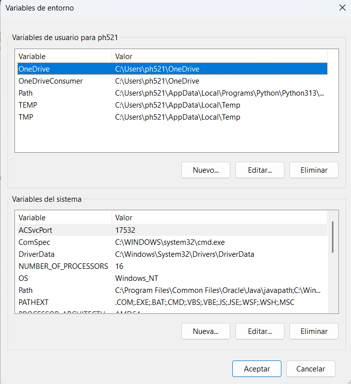
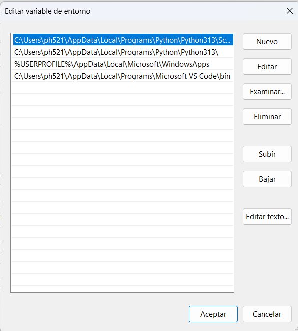

<!-- HEADINGS -->
# Documentación Python 

## Instalación de Python
1-	Vamos a *google* y buscamos **Python** y entrar en ~~Downloands~~.

2-	Aquí en esta ventana dar clic en descargar Python 3.13.1

Aquí podemos ver como comienza la descarga. 

3-	A hora procedemos abrir Python.

4-	Aquí en esta ventana seleccionamos las dos opciones que están en la parte de abajo py.exe y phat.
Py.exe es el ejecutable de Python y PHAT es un módulo que se utiliza para manipular rutas locales.

6- Después comenzara la descarga 

En esta parte solo damos clic en cerrar 

 
7-	Editar las variables de entorno
 para ello vamos al buscador y escribimos variables de entorno y entramos en la ventana que nos aparece en la parte derecha.
 

8- Aquí nos dirigimos en la parte de abajo y entramos dando un clic en variables de entorno.
 

9- Aquí en esta parte ubicamos path y entramos dando doble clic.
 

10- podemos observar en path si tenemos Python.
 

